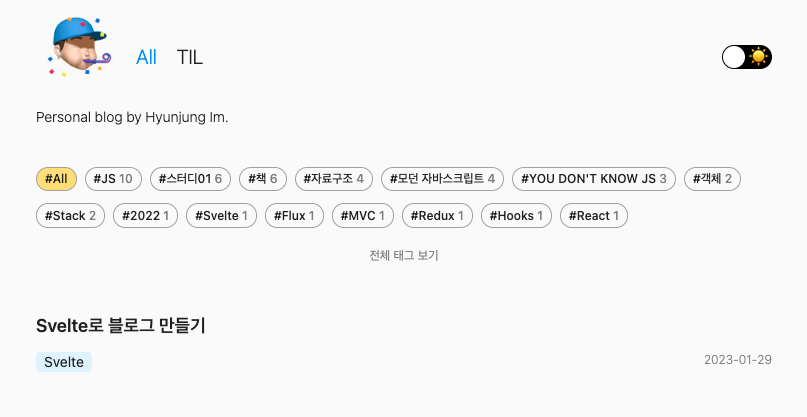
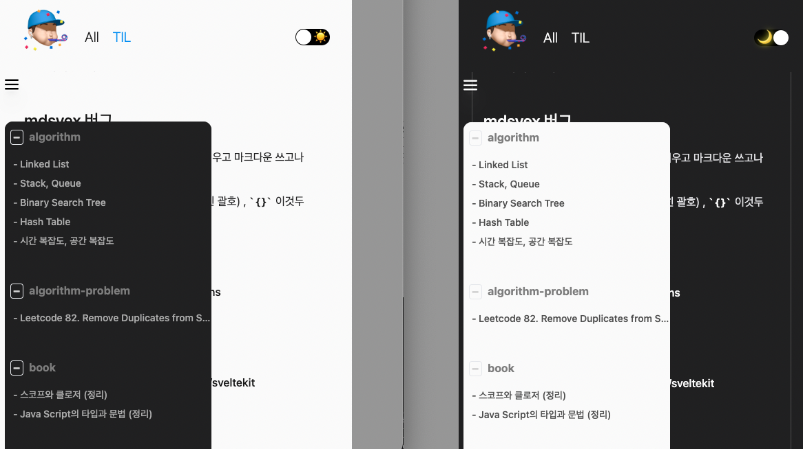

# Blog Project



이 프로젝트는 저의 작은 실험장입니다.🧪  
<br />
시도해보고 싶은 라이브러리 또는 프레임워크 등을 적용해보고 직접 사용해보면서 어떤 점을 더 개선할 수 있을지, 어떻게 하면 더 사용하기 편할지 생각하며 천천히 업데이트하고 있습니다.🐌

<br />

### Table of contents

- [Update Record](https://github.com/h-alex2/h-blog#update-record)
- [Blog v2 Recap](https://github.com/h-alex2/h-blog#blog-v2-recap)
- [Why use Svelte?](https://github.com/h-alex2/h-blog#why-use-svelte)
- [Schedule](https://github.com/h-alex2/h-blog#schedule)
- [Feature](https://github.com/h-alex2/h-blog#feature)
- [느낀 점](https://github.com/h-alex2/h-blog#%EB%8A%90%EB%82%80-%EC%A0%90)

## Update Record

- 22.12.23 - v1.0.0 (`Next.js`, `Styled-component`, `Markdown`)
- 23.02.01 - v2.0.0 (`Svelte kit`, `Tailwind`, `Mdsvex`)

<br />

# Blog v2 Recap🚀

`Next.js`로 만들었던 블로그를 `Svelte kit`으로 변경하였습니다.  

<br />

## Why use Svelte?

당연하다 생각했던 Virtual Dom의 역할 없이 더 작은 번들 사이즈, 더 빠른 로드 시간을 얻을 수 있다는 점이 흥미로웠습니다. 스벨트는 로드할 라이브러리가 없고 컴파일러이기 때문에 빌드 타임에 애플리케이션 코드를 해석해 로드할 때 이미 실행 가능한 javascript 파일이 있다는 점이 굉장히 매력적이게 다가왔습니다.  
공부를 하다 보니 직접 제 프로젝트에 적용하면서 배워보고 싶다는 생각이 들어 블로그에 직접 적용해보게 되었습니다.
그리고 가장 빠르다는 빌더인 esbuild를 사용하는 vite도 함께 사용해보고 싶었습니다. 

React 라이브러리는 이미 대중적으로 많은 곳에서 사용하고 있지만 스벨트는 아직 거쳐야 할 관문이 많을 수 있다고 들었습니다. 발전해가는 과정에 있는 프레임워크를 사용해보면서 어떤 문제가 생기고 어떤 방향으로 발전해가는지 볼 수 있단 점에서 배울 점이 많을 것이라는 생각이 들었고 업데이트될 때마다 제 블로그도 함께 업데이트하면서 공부하고자 합니다.

<br />

## Schedule

| Data     | Schedule                            |
| -------- | ----------------------------------- |
| 23.01.27 | Svelte 학습 (공식문서 활용)         |
| 23.01.28 | Svelte kit 학습 (공식문서 활용)     |
| 23.01.29 | Svelte kit 템플릿 적용 후 변경 시작 |
| 23.01.30 | 기능 업데이트                       |
| 23.01.31 | til 페이지 만들기, css 적용         |
| 23.02.01 | 스타일 수정, 재배포                 |

<br />

## Feature

### fs에서 glob으로 변경

여러 모듈을 한 번에 가져올 수 있는 방법인 `vite`의 `glob`을 사용했습니다. file system을 사용하지 않고 `*.md`게시물을 가져올 수 있었습니다. 모든 posts를 들고오는 util 함수가 v1에서는 80줄을 넘어가는 반면 `glob`을 이용하니 30줄로 끝낼 수 있었습니다.

동기적으로 가져오기 위해 `eager` 속성을 사용하였습니다.

<br />

### mdsvex 사용

`markdown` 파일 안에서 `svelete` 컴포넌트를 사용할 수 있는 `mdx svelte`용 버전인 `mdsvex`를 사용하였습니다. config 파일을 통해 사용할 `rehype`, `remark` 플러그인을 배열 안에 넣어 편하게 사용할 수 있었습니다.

mdsvex는 마크다운 파일을 import하여 컴포넌트처럼 쓸 수 있어 glob으로 모듈을 받은 후 module 데이터 안의 proxy component를 사용해 처리하였습니다.

그리고 md 파일 안에서 code 영역이 아닌 text로 `<>`, `{}` 괄호를 사용하면 파싱 에러가 나는 문제가 있었습니다. 2020년부터 이슈로 등록된 문제였지만 아직 해결되지 않은 듯 하여 포스트 본문 내에서 괄호를 썼던 부분을 다 수정하였습니다.

<br />

### TIL 제작 + 모바일 대응

블로그 포스트와 공부용 포스트를 분리하기 위해서 TIL 메뉴를 만들었습니다. til 리스트 메뉴는 `sticky`로 고정하였습니다. 모바일 사이즈의 경우 메뉴 버튼을 눌렀을 때 til 리스트 메뉴를 모달로 띄우는 방법을 선택했습니다. 뒷 배경 또는 메뉴 버튼을 클릭하면 모달이 닫히도록 해주었습니다.



<br />

### event delegate 문제 해결

위 til 리스트 메뉴를 모달창으로 띄운 후 뒷 배경을 눌렀을 때 닫히도록 하기 위해서 상위 div 노드에 모달창을 닫는 이벤트를 넣었습니다. 이벤트 위임에 의해 하위 모달 컴포넌트에도 이벤트가 적용되는 문제가 생겨 해결하기 위해 모달 컴포넌트 안 이벤트 위임을 취소할 노드에 `data-set`을 적용하고 이벤트 핸들러 내에서 이벤트의 `data-set`이 앞에서 적용한 `data-set`이라면 이벤트 처리가 되지 않도록 해주었습니다.

<br />

### Light Dark 테마 적용

제 [StoryStorage](https://www.storystorage.me/) 프로젝트에서 적용해봤던 light/dark 테마 적용을 업그레이드 시켜 적용해보았습니다. 이 프로젝트에서는 테마 변경이 일회성으로 끝났지만, 이번 프로젝트에서는 localStorage에 저장시키는 방법을 사용했습니다. 테마를 변경할 때 컴포넌트 내에서 적용하면 `FOUC` 현상이 일어나 깜빡이는 현상이 발생하기 때문에 권장하는 방법인 head에 로직을 넣는 방법을 이용하였습니다.
색상 관리를 더 편하게 하기 위해서 tailwind config theme extend에 light, dark로 테마 color를 추가하여 사용했습니다.

```js
  theme: {
    extend: {
      colors: {
        pointColor: {
          900: "#3e86f6",
          700: "#e0f3ff",
          500: "#f7fbff"
        },
        pointInvertColor: "#ffe16b",
        darkPointColor: {
          900: "#3e86f6",
          700: "#323845",
          500: "#171717"
        },
        darkPointInvertColor: "#3e86f6",
        defaultColor: {
          900: "#202021",
          800: "#474747",
          700: "#7d7d7d",
          600: "#ababab",
          500: "#d1d1d1"
        },
        ...
      }
    }
  }
```

<br />

## 느낀 점

1. Svelte를 이번에 처음 사용해봤는데, 진입 장벽이 높지 않다는 느낌이 들어 좋았습니다. 공식 문서의 설명도 잘 돼 있어서 문서를 보고 적용하기 편했습니다.

2. routing은 `Next.js`처럼 폴더명으로 라우팅할 수 있었는데, `svelte kit`의 경우에는 `+page.js` 파일의 응답 값을 `+page.svelte` 컴포넌트로 전달하는 방식을 사용합니다. Next.js의 `getServerSideProps, getStaticProps` 역할을 page.js파일이 하게 되는 것인데 라우팅이 늘어나다 보면 같은 이름의 `+page.xx` 파일이 많아져 구분하기가 힘든 점이 있었습니다.

3. 스벨트에 대한 궁금증을 해소할 수 있는 경험이었습니다. 기본적인 부분만 다뤄봤지만 계속해서 업데이트될 것 같아 어떻게 변화할지 기대가 되는 툴이었습니다.

4. React에 대해서 생각하는 시각을 바꾸는 계기가 되었습니다. 리액트를 위주로 사용해왔기 때문에 가상돔의 작업 방식을 당연하게만 생각해왔습니다. React의 hooks나 생명주기에 대해 편하다고만 생각했던 시각을 이제는 더 다양한 시각으로 바라보아야겠다고 생각하게 되었습니다. React방식으로만 항상 생각했지만, 그 방식이 좀 더 많은 메모리를 사용하게 되는 방법일 수도 있고, 더 개선할 수 있는 점이 있을 수도 있다는 것을 깨달았습니다. 이로써 항상 다른 관점에서 바라보고 조금 더 열려있는 시각으로 바라봐야겠다고 다짐하게 되었습니다.

   <br />

## TO DO

- [ ] TypeScript로 변경
- [ ] 프로젝트 메뉴 제작하기
- [X] npm -> yarn으로 변역
- [ ] 블로그 제작 포스트 작성
- [ ] 테스트 코드 작성

> Blog Reference
> [miryang.dev](https://miryang.dev/blog)
